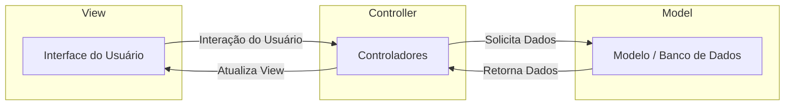

<!-- omit in toc --> 
# Lab Scheduler
Interface gráfica para agendamento de laboratórios em ambiente acadêmico

- [Como Executar a Aplicação de Teste](#como-executar-a-aplicação-de-teste)
  - [Pré-requisitos](#pré-requisitos)
  - [MacOS e Linux](#macos-e-linux)
  - [Windows (usando WSL 2)](#windows-usando-wsl-2)
    - [Passos para Configurar o WSL 2](#passos-para-configurar-o-wsl-2)
- [Arquitetura do Projeto](#arquitetura-do-projeto)
  - [Fluxo MVC](#fluxo-mvc)
  - [Componentes Principais](#componentes-principais)
  - [Banco de Dados](#banco-de-dados)

## Como Executar a Aplicação de Teste

### Pré-requisitos

- **Python 3.8+**
- **Docker (com Docker Compose)**

### MacOS e Linux

1. **Clone o repositório:**

   ```bash
   git clone https://github.com/bruno-pagani-ceub/lab-scheduler.git
   cd lab-scheduler
   ```

2. **Instale o Docker e Docker Compose:**

   - Siga as instruções oficiais em [Docker para Mac](https://docs.docker.com/docker-for-mac/install/) ou [Docker para Linux](https://docs.docker.com/engine/install/).

3. **Instale o Tkinter (se necessário):**

   - MacOS:

    ```bash
    brew install python-tk
    ```
    - Linux (Ubuntu/Debian):

    ```bash
    sudo apt-get install python3-tk
    ```

4. **Execute o ambiente de teste:**

   ```bash
   make test
   ```

   Isso irá:

   - Criar um ambiente virtual Python.
   - Instalar as dependências do projeto nele.
   - Iniciar o contêiner do MySQL para testes.
   - Executar a aplicação localmente conectando-se ao banco de dados de teste já pré-preenchido.

5. **Encerrar a aplicação e limpar os recursos:**

   ```bash
   make clean
   ```

### Windows (usando WSL 2)

**Windows Subsystem for Linux (WSL)** é uma camada de compatibilidade que permite aos usuários do Windows executarem binários Linux nativamente.

#### Passos para Configurar o WSL 2

1. **Ativar o WSL:**

   - Abra o PowerShell como administrador e execute:

     ```powershell
     wsl --install
     ```

   - Isso irá instalar o WSL 2 e a distribuição padrão do Ubuntu.

2. **Reinicie o computador** quando solicitado.

3. **Atualize o WSL para a versão 2 (se necessário):**

   ```powershell
   wsl --set-default-version 2
   ```

4. **Instale o Docker Desktop para Windows:**

   - Baixe e instale o [Docker Desktop](https://www.docker.com/products/docker-desktop).
   - Nas configurações do Docker Desktop, habilite a integração com o WSL 2.

5. **Abra o Ubuntu no WSL:**

   - Procure por "Ubuntu" no menu Iniciar e abra.

6. **Clone o repositório dentro do WSL:**

   ```bash
   git clone https://github.com/bruno-pagani-ceub/lab-scheduler.git
   cd lab-scheduler
   ```

7. **Instale o Python e outras dependências:**

   ```bash
   sudo apt update
   sudo apt install python3 python3-venv python3-pip -y
   ```

8. **Instale o Tkinter:**

    ```bash
    sudo apt-get install python3-tk
    ```
    > Nota: O Tkinter é necessário para a interface gráfica da aplicação.   Certifique-se de instalá-lo dentro do WSL.

9. **Execute o ambiente de teste:**

   ```bash
   make test
   ```

10. **Encerrar a aplicação e limpar os recursos:**

    ```bash
    make clean
    ```

## Arquitetura do Projeto

Este projeto segue o padrão arquitetural [**MVC (Model-View-Controller)**](https://pt.wikipedia.org/wiki/MVC), que separa a aplicação em três componentes principais:

- **Model (Modelo):** Gerencia os dados e a lógica de negócios. Responsável pela interação com o banco de dados.
- **View (Visão):** Lida com a interface do usuário e a apresentação dos dados.
- **Controller (Controlador):** Interpreta as entradas do usuário e as converte em chamadas para o modelo ou visualização.

### Fluxo MVC



**Descrição do Fluxo:**

1. Usuário interage com a interface **(View)**.
2. **View** envia as ações do usuário para o **Controller**.
3. **Controller** processa a entrada, possivelmente validando e transformando os dados.
4. **Controller** solicita ou atualiza dados no **Model**.
5. **Model** retorna os dados processados para o **Controller**.
6. **Controller** atualiza a **View** com os novos dados ou estado.

### Componentes Principais

- **Models (`lab_scheduler/database/models`):**
  - Gerencia as operações com o banco de dados.

- **Controllers (`lab_scheduler/controllers/`):**
  - Controlam o fluxo de dados entre a View e o Model.

- **Views (`lab_scheduler/views/`):**
  - Responsáveis pela interface gráfica utilizando Tkinter.
  - **Templates** (`templates/`): Contém modelos reutilizáveis para componentes da interface.

- **Services (`lab_scheduler/services/`):**
  - Responsáveis por outros serviços não diretamente relacionados com a interface gráfica, como geração de relatários

- **Utils (`lab_scheduler/utils/`):**
  - Funções auxiliares e de validação utilizadas em toda a aplicação.

### Banco de Dados

O banco de dados MySQL é utilizado para persistência dos dados.

---

Para mais detalhes da execução do projeto, consulte a documentação completa nos arquivos dentro da pasta `docs/`.
