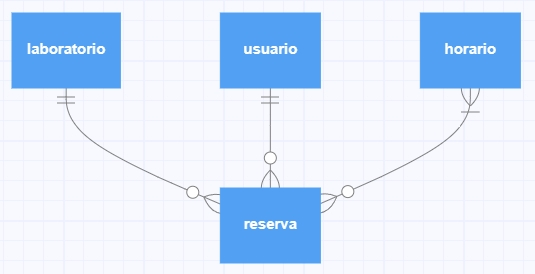
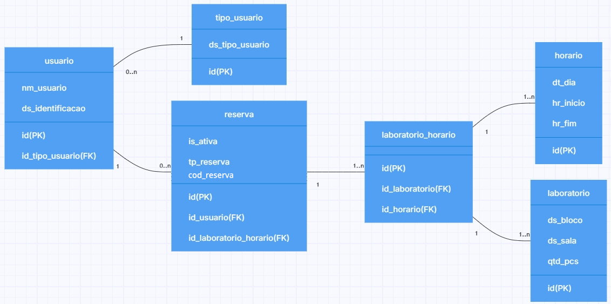

# Modelo conceitual

Na modelagem do banco de dados do lab-scheduler, identificamos quatro entidades fundamentais para sua função, em que uma está no centro e três se relacionam a ela.

A central é a entidade "**reserva**". Ela se conecta ao "**usuário**" em uma relação 1:N, visto que o usuário pode não ter nenhuma reserva ativa, uma, ou diversas, dependendo de sua necessidade de uso de laboratórios. No sentido oposto, decidimos que cada reserva pode ser realizada por um usuário singular, de forma que, se existe uma reserva, existe um único usuário responsável por ela.

A entidade "**laboratório**" também se relaciona à "reserva" de forma 1:N, pois decidimos que cada reserva se refere a um laboratório de cada vez, e, caso o usuário deseje reservar mais de um laboratório, serão reservas tratadas separadamente. No sentido oposto, um laboratório pode estar disponível (sem reservas), com uma reserva, ou diversas, dependendo de sua disponibilidade de horários e se está em manutenção.

Por fim, a entidade "**horário**", relacionada com a reserva em uma relação N:N, determina como a instituição realiza a divisão de faixas de horário para os laboratórios, sendo populada todo início de semestre com base nos planos da administração e das necessidades dos professores e funcionários. 

# Modelo lógico

Na etapa de modelagem lógica, atribuímos ao usuário as características "nome", "posição" (que pode ser aluno, professor, funcionário ou visitante) e identificação (que depende da posição, podendo ser a matrícula de professor ou funcionário, RA de aluno, ou CPF de visitante).

Os laboratórios, por sua vez, são identificados pelo número do bloco, número da sala, e a quantidade de computadores à disposição.

Os horários determinam as informações temporais relativas ao semestre: dia da semana, data, horário de início e fim da reserva, bem como se o laboratório estará bloqueado em determinados momentos, impedindo novas reservas.

Por fim, cada reserva tem identificação do usuário titular, o laboratório reservado, informações sobre o horário da reserva, o status da reserva (confirmada, finalizada, ou cancelada), e a identificação caso seja referente a manutenção.

Com esses dados disponíveis, é possível organizar o sistema de reservas de maneira eficiente e programar um sistema que realize sua função de forma satisfatória.